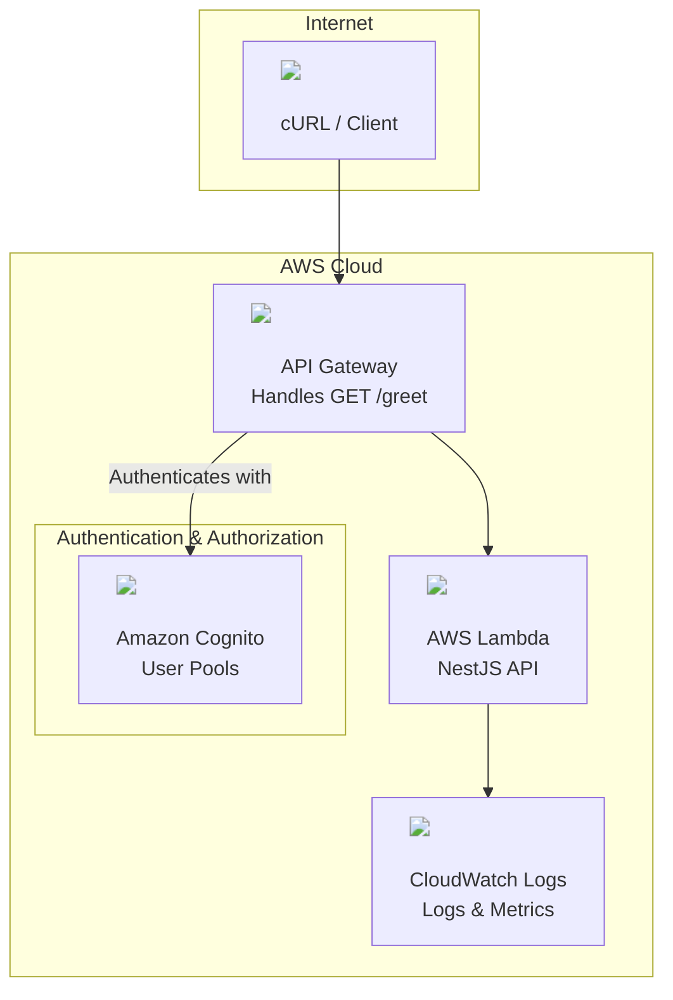

````markdown name=README.md
## Example Architecture Diagram

Below is a sample architecture diagram rendered with [Mermaid](https://mermaid-js.github.io/mermaid/#/) and using icons from this repository:



> **Note:** Mermaid diagrams with embedded images render best on supported platforms. For GitHub, you may need to use a browser extension or render the diagram externally.

---

## About

This project hosts AWS architecture icons for easy use in technical documentation and diagrams.  
Icons are sourced and organized for clarity and convenience.
````