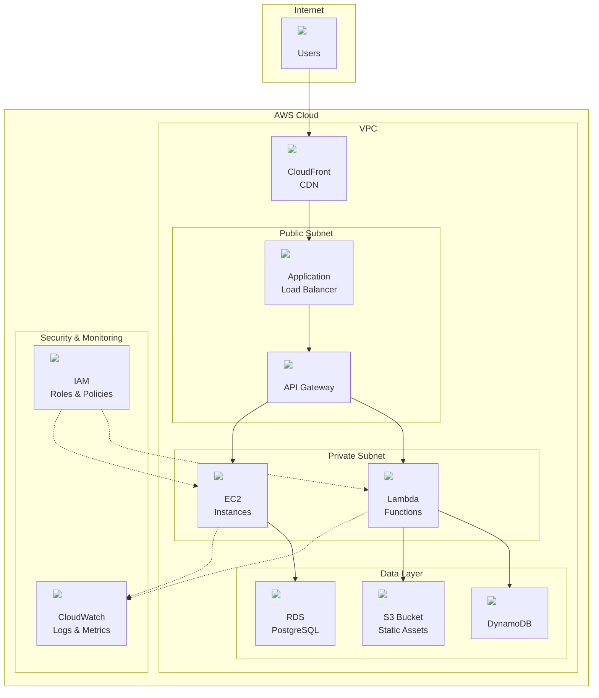

# AWS Architecture Icons Repository

A comprehensive collection of AWS architecture icons organized for easy access and use in technical documentation, presentations, and diagrams.

[](https://github.com/icacho-dev/aws-architecture-icons/releases)
[](LICENSE)
[](https://github.com/icacho-dev/aws-architecture-icons/issues)

## 📋 Table of Contents

- [Overview](#overview)
- [Repository Structure](#repository-structure)
- [Usage Examples](#usage-examples)
- [Icon Categories](#icon-categories)
- [Integration Guide](#integration-guide)
- [File Formats and Sizes](#file-formats-and-sizes)
- [Quick Reference](#quick-reference)
- [Contributing](#contributing)
- [License](#license)

## 🌟 Overview

This repository contains the latest AWS architecture icons (February 2025 release) organized in a clear, accessible structure. Perfect for:

- ✅ Technical documentation
- ✅ Architecture diagrams
- ✅ Presentations and slides
- ✅ Training materials
- ✅ Web applications and dashboards

## 📁 Repository Structure

```
📦 aws-architecture-icons/
├── 🏗️  Architecture-Group-Icons_02072025/     # Structural elements (VPC, subnets, etc.)
├── 🔧  Architecture-Service-Icons_02072025/   # AWS service icons by category
├── 📂  Category-Icons_02072025/              # Category grouping icons
└── 🎯  Resource-Icons_02072025/              # Specific resource icons
```

### Icon Organization

**Architecture Service Icons** are organized by AWS service categories:
- **Analytics** (Athena, QuickSight, Redshift, etc.)
- **Compute** (EC2, Lambda, ECS, etc.)
- **Database** (RDS, DynamoDB, ElastiCache, etc.)
- **Networking & Content Delivery** (CloudFront, VPC, ELB, etc.)
- **Security, Identity & Compliance** (IAM, Cognito, KMS, etc.)
- **Storage** (S3, EBS, EFS, etc.)
- And 18+ more categories

## 🚀 Usage Examples

### Mermaid Diagrams



### HTML/Markdown

```html
<!-- Direct usage in HTML -->


<!-- In Markdown -->

```

### Draw.io / Lucidchart

1. Download the SVG files locally
2. Import as custom shapes/stencils
3. Use in your diagrams

## 🏷️ Icon Categories

### Architecture Service Icons (24 Categories)
| Category | Examples | Count |
|----------|----------|-------|
| **Analytics** | Athena, QuickSight, Redshift | 15+ |
| **Compute** | EC2, Lambda, ECS, Fargate | 20+ |
| **Database** | RDS, DynamoDB, Aurora | 12+ |
| **Networking** | VPC, CloudFront, Route 53 | 18+ |
| **Security** | IAM, Cognito, KMS, WAF | 15+ |
| **Storage** | S3, EBS, EFS, Glacier | 10+ |
| **AI/ML** | SageMaker, Rekognition, Lex | 12+ |
| **Containers** | EKS, ECS, ECR | 8+ |

[View all categories →](Architecture-Service-Icons_02072025/)

### Resource Icons
Specific resource representations for detailed architecture diagrams.

### Group Icons
Structural elements like VPCs, subnets, availability zones, and regions.

## 🔧 Integration Guide

### CDN URLs
All icons are available via GitHub's raw content URLs:

```
https://raw.githubusercontent.com/icacho-dev/aws-architecture-icons/main/{path-to-icon}
```

### Local Development
```bash
# Clone the repository
git clone https://github.com/icacho-dev/aws-architecture-icons.git

# Use icons locally
cd aws-architecture-icons
```

### Popular Tools Integration

**Mermaid.js**: Use raw GitHub URLs in `` tags  
**Draw.io**: Import SVG files as custom libraries  
**Lucidchart**: Upload SVG files as custom shapes  
**PowerPoint**: Copy and paste SVG files directly  
**Figma**: Import SVG files as components

## 📏 File Formats and Sizes

### Available Formats
- **SVG**: Vector format, scalable, recommended for web
- **PNG**: Raster format, good for presentations

### Available Sizes
- **16px**: Small icons for compact layouts
- **32px**: Medium icons for standard use
- **48px**: Large icons for prominent display
- **64px**: Extra large icons for presentations

### File Naming Convention
```
{Type}_{Service-Name}_{Size}.{format}
```

Examples:
- `Arch_AWS-Lambda_48.svg`
- `Res_Amazon-S3_32.png`

## ⚡ Quick Reference

### Most Popular Icons

| Service | 48px SVG Link |
|---------|---------------|
| **Lambda** | [📎 SVG](https://raw.githubusercontent.com/icacho-dev/aws-architecture-icons/main/Architecture-Service-Icons_02072025/Arch_Compute/48/Arch_AWS-Lambda_48.svg) |
| **S3** | [📎 SVG](https://raw.githubusercontent.com/icacho-dev/aws-architecture-icons/main/Architecture-Service-Icons_02072025/Arch_Storage/48/Arch_Amazon-S3_48.svg) |
| **EC2** | [📎 SVG](https://raw.githubusercontent.com/icacho-dev/aws-architecture-icons/main/Architecture-Service-Icons_02072025/Arch_Compute/48/Arch_Amazon-EC2_48.svg) |
| **RDS** | [📎 SVG](https://raw.githubusercontent.com/icacho-dev/aws-architecture-icons/main/Architecture-Service-Icons_02072025/Arch_Database/48/Arch_Amazon-RDS_48.svg) |
| **API Gateway** | [📎 SVG](https://raw.githubusercontent.com/icacho-dev/aws-architecture-icons/main/Architecture-Service-Icons_02072025/Arch_Networking-Content-Delivery/48/Arch_Amazon-API-Gateway_48.svg) |

### URL Template
```
https://raw.githubusercontent.com/icacho-dev/aws-architecture-icons/main/
Architecture-Service-Icons_02072025/
Arch_{Category}/
{Size}/
Arch_{Service-Name}_{Size}.svg
```

## 🤝 Contributing

We welcome contributions! Please:

1. 🍴 Fork the repository
2. 🔄 Create a feature branch
3. 📝 Submit a pull request

### Reporting Issues
Found a missing icon or broken link? [Open an issue](https://github.com/icacho-dev/aws-architecture-icons/issues/new).

## 📄 License

Icons are sourced from AWS and organized for community use. Please refer to [AWS's official icon usage guidelines](https://aws.amazon.com/architecture/icons/) for commercial usage terms.

---

## 💡 Tips & Best Practices

- **Use SVG format** for web applications and scalable diagrams
- **Use 48px size** for most documentation needs
- **Combine with group icons** for complete architecture diagrams
- **Cache locally** for offline presentations
- **Maintain consistency** in icon sizes within the same diagram

> **Note**: This repository is updated regularly with the latest AWS icon releases. Star ⭐ the repo to stay updated!
